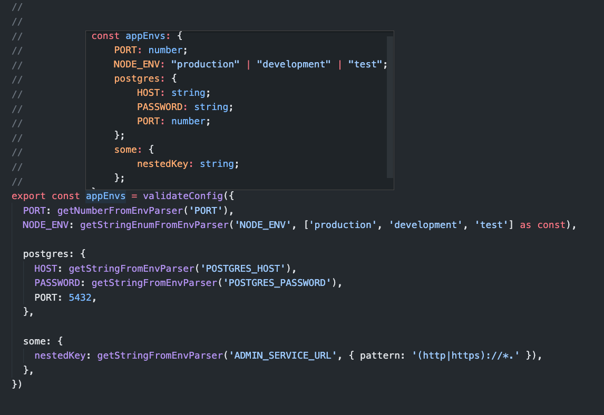

# Typed env parser

No dependency, 13.2 kB small library which help you to properly validate all environment variables.
Library supports

- Runtime JavaScript validation
- Inferred static time Typescript validation
- Beautiful error logging
- Many different data types
- Simply extends library with custom data type parser

## Example usage

```bash
npm i typed-env-parser
```

```typescript
import {
  getNumberFromEnvParser,
  getStringEnumFromEnvParser,
  getStringFromEnvParser,
  validateConfig,
} from 'typed-env-parser'

export const appEnvs = validateConfig({
  PORT: getNumberFromEnvParser('PORT'),
  NODE_ENV: getStringEnumFromEnvParser('NODE_ENV', ['production', 'development', 'test'] as const),

  postgres: {
    HOST: getStringFromEnvParser('POSTGRES_HOST'),
    PASSWORD: getStringFromEnvParser('POSTGRES_PASSWORD'),
    PORT: 5432,
  },

  some: {
    nestedKey: getStringFromEnvParser('ADMIN_SERVICE_URL', { pattern: '(http|https)://*.' }),
  },
})
```



## Requirements

Typescript >= 4.1.5

## Philosophical part of the library

### One source of truth

You have only 1 source of truth in your codebase.
Thanks to Typescript inferring you can get static data type directly from the Javascript implementation
(Like in the example upper).

### No Default values

Default values for environment variables are anti-pattern.
It may happen that you forget to add PORT in the production and your app silently fails and you have no idea why.
So we recommend not to set default environment values in your Javascript codebase.

### Batched runtime validator errors

If you don't define some of your variables or the env validation fails
`typed-env-parser` will batch and show all error messages in one Error interruption.


### Extensible API

Library brings simple extensible API on how to write custom parser function.

```typescript
import { ValidationError, validateConfig } from 'typed-env-parser'

// --- custom parser code starts ---
export const myCustomNumberRangeParser = (envName: string, from: number, to: number) => () => {
  const envValue = process.env[envName]?.trim()
  const parsedNum = parseFloat(envValue ?? '')
  if (isNaN(parsedNum)) {
    throw new ValidationError('Value is not parsable as integer', envName)
  }
  if (parsedNum <= from || parsedNum >= to) {
    throw new ValidationError(`Value is not in the range <${from}, ${to}>`, envName)
  }
  return parsedNum
}
// --- custom parser code ends ---

export const appEnvs = validateConfig({
  PORT: myCustomNumberRangeParser('PORT', 1000, 2000),
})
```

And the error output will look like this:

```txt
Error: 'PORT': Error: Value is not in the range <1000, 2000>, current value of 'PORT' is '2020'
```
